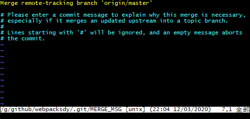

# 2020-03-12

这次我预先在github新建了一个仓库：`https://github.com/clg333zzz/webpacksdy`。
有默认的`.gitignore`、`README.md`两个文件。

然后在本地新建了一个文件夹`webpacksdy`，之后运行命令`git init`。

想着来复习一次远程关联的操作，结果还是不太顺畅，

## 关联远程仓库第一式

本地没有任何提交。

```bash
git remote add origin https://github.com/clg333zzz/webpacksdy
git pull
```

只要这两条命令就已经ok了，本地已经就有了一个关联到远程分支的本地master分支。

如果本地已经有了commit怎么办？

## 关联远程仓库第二式

我把所有的东西删除又测试了一遍。

此时本地新建了一个`1.txt`文件，并提交生成了一个`commit`。

```bash
$ git log
commit 012af070bef289e9ad390b80a3ea4879ef63d05c
Author: clg333zzz <clg333zzz@163.com>
Date:   Thu Mar 12 21:48:44 2020 +0800

    add 1.txt for test remote origin
```

此时再关联远程分支

```bash
$ git remote add origin https://github.com/clg333zzz/webpacksdy
$ git pull

warning: no common commits
remote: Enumerating objects: 4, done.
remote: Counting objects: 100% (4/4), done.
remote: Compressing objects: 100% (3/3), done.
remote: Total 4 (delta 0), reused 0 (delta 0), pack-reused 0
Unpacking objects: 100% (4/4), done.
From https://github.com/clg333zzz/webpacksdy
 * [new branch]      master     -> origin/master
There is no tracking information for the current branch.
Please specify which branch you want to merge with.
See git-pull(1) for details.

    git pull <remote> <branch>

If you wish to set tracking information for this branch you can do so with:

    git branch --set-upstream-to=origin/<branch> master
```

我看上面东西已经拉下来了，我想把内容合到本地master分支。

```bash
$ git merge origin/master
fatal: refusing to merge unrelated histories
```

又报错了，怎么回事，上面提示“拒绝合并没有关联的历史”。

找到一篇文章[记Git报错-refusing to merge unrelated histories](https://blog.csdn.net/u012145252/article/details/80628451)。里面提示可以使用`--allow-unrelated-histories`参数。

```bash
$ git merge --allow-unrelated-histories origin/master
```

此时会弹出vi编辑界面：



然后我们输入`:wq`保存退出，此时界面输出如下。

```bash
$ git pull
There is no tracking information for the current branch.
Please specify which branch you want to merge with.
See git-pull(1) for details.

    git pull <remote> <branch>

If you wish to set tracking information for this branch you can do so with:

    git branch --set-upstream-to=origin/<branch> master


Merge made by the 'recursive' strategy.ebpacksdy (master)
 .gitignore | 104 +++++++++++++++++++++++++++++++++++++++++++++++++++++++++++++
 README.md  |   2 ++
 2 files changed, 106 insertions(+)
 create mode 100644 .gitignore
 create mode 100644 README.md
```

## 总结

1. 第一式，本地无任何提交。

```bash
$ git remote add origin https://github.com/clg333zzz/webpacksdy
$ git pull
```

2. 第二式，本地有commit，远端也有commit。

```bash
$ git remote add origin https://github.com/clg333zzz/webpacksdy
$ git pull
$ git branch --set-upstream-to=origin/<branch> master
```
